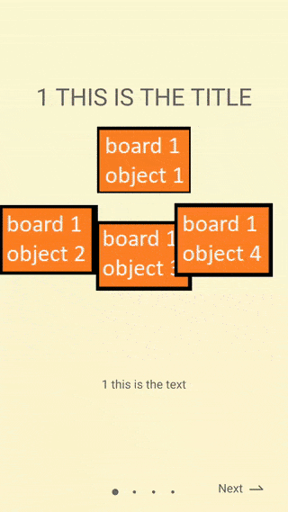

# Onboarding-Library


## Installation

To install the current stable version, first add the address of maven repository to the list of repositories. This is usually located in the `build.gradle` of your **project** module.

```groovy
repositories {
    maven { url 'https://jitpack.io' }
}
```

Then, add this to the `build.gradle` of your **app** module:

```groovy
dependencies {
    implementation 'com.github.roknimohsen:Onboarding-Library:0.1.0'
}
```
### How to use
Add the **.png** files you want to use as objects shown in the picture to your **drawable** directory


Create **activty_main.xml** in **layout** directory
```xml
<?xml version="1.0" encoding="utf-8"?>
<androidx.constraintlayout.widget.ConstraintLayout xmlns:android="http://schemas.android.com/apk/res/android"
    xmlns:app="http://schemas.android.com/apk/res-auto"
    xmlns:tools="http://schemas.android.com/tools"
    android:layout_width="match_parent"
    android:layout_height="match_parent"
    tools:context=".MainActivity"
    android:id="@+id/main">


</androidx.constraintlayout.widget.ConstraintLayout>
```

Create an **Activity** and add the below code

```kotlin
import android.graphics.drawable.Drawable
import android.os.Bundle
import androidx.appcompat.app.AppCompatActivity
import com.mohsenrokni.onboardinglibrary.Onboarding
import kotlinx.android.synthetic.main.activity_main.*

class MainActivity : AppCompatActivity() {

    override fun onCreate(savedInstanceState: Bundle?) {
        super.onCreate(savedInstanceState)
        setContentView(R.layout.activity_main)

        val board1settings = Onboarding.BoardSetting()
        board1settings.title = "1 THIS IS THE TITLE"
        board1settings.text = "1 this is the text"
        val board1drawables = mutableListOf<Drawable>(
            resources.getDrawable(R.drawable.board_1_object_1),
            resources.getDrawable(R.drawable.board_1_object_2),
            resources.getDrawable(R.drawable.board_1_object_3),
            resources.getDrawable(R.drawable.board_1_object_4)
        )
        board1settings.drawableList = board1drawables

        val board2settings = Onboarding.BoardSetting()
        board2settings.title = "2 THIS IS THE TITLE"
        board2settings.text = "2 this is the text"
        val board2drawables = mutableListOf<Drawable>(
            resources.getDrawable(R.drawable.board_2_object_1),
            resources.getDrawable(R.drawable.board_2_object_2),
            resources.getDrawable(R.drawable.board_2_object_3)
        )
        board2settings.drawableList = board2drawables

        val board3settings = Onboarding.BoardSetting()
        board3settings.title = "3 THIS IS THE TITLE"
        board3settings.text = "3 this is the text"
        val board3drawables = mutableListOf<Drawable>(
            resources.getDrawable(R.drawable.board_3_object_1),
            resources.getDrawable(R.drawable.board_3_object_2),
            resources.getDrawable(R.drawable.board_3_object_3),
            resources.getDrawable(R.drawable.board_3_object_4)
        )
        board3settings.drawableList = board3drawables

        val board4settings = Onboarding.BoardSetting()
        board4settings.title = "4 THIS IS THE TITLE"
        board4settings.text = "4 this is the text"
        val board4drawables = mutableListOf<Drawable>(
            resources.getDrawable(R.drawable.board_4_object_1),
            resources.getDrawable(R.drawable.board_4_object_2),
            resources.getDrawable(R.drawable.board_4_object_3)
        )
        board4settings.drawableList = board4drawables

        val onboardingView = Onboarding()
            .withActivity(this)
            .withColor(R.color.onboarding_00,
                R.color.onboarding_01,
                R.color.onboarding_02,
                R.color.onboarding_03)
            .withBoardSettings(mutableListOf(board1settings, board2settings, board3settings, board4settings))
            .withNextListener{
                //do something
                //go to next activity
            }
            .getView()

        main.addView(onboardingView)
    }
}
```
